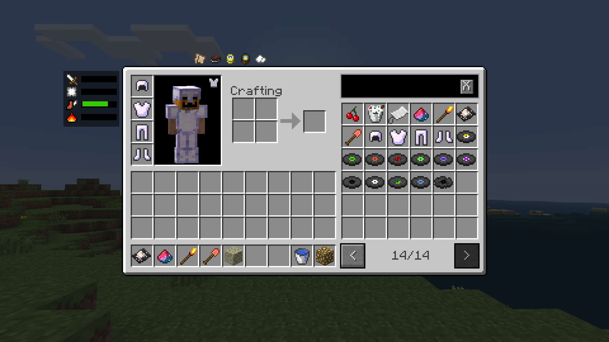

# BTA Babric Example Mod

A babric mod for BTA with examples for items, blocks, mixins, invokers and accessers.  
Future plans include entities, portals, dimensions, and custom armor sprites.

## Prerequisites
- JDK for Java 17 [(Eclipse Temurin](https://adoptium.net/temurin/releases/) recommended)
- IntelliJ IDEA
- Minecraft Development plugin (Optional, but highly recommended)

## Setup steps

1. Download or clone this repository and put it somewhere.
```
git clone https://github.com/azurelmao/bta-babric-example-mod.git
```

2. Import the project in IntelliJ IDEA, close it and open it again.

3. Create a new run configuration by going in `Run > Edit Configurations`  
   Then click on the plus icon and select Gradle. In the `Tasks and Arguments` field enter `build`  
   Running it will build your finished jar files and put them in `build/libs/`

4. Open `File > Settings` and head to `Build, Execution, Development > Build Tools > Gradle`  
   Change `Build and run using` and `Run tests using` to `IntelliJ IDEA`

5. Open `File > Project Structure` and:
    - select `Project` and set `Compiler output` to your project's path.
    - select `Modules` and in both modules go into `Dependencies` and set `minecraft-client-base.jar` to `Runtime`


6. Done! Now all that's left is to change every mention of `examplemod` to your own mod id. Happy modding!

## Screenshots
Small sneakpeak of what the mod has in store.

Hm, I wonder where this fire came from?
